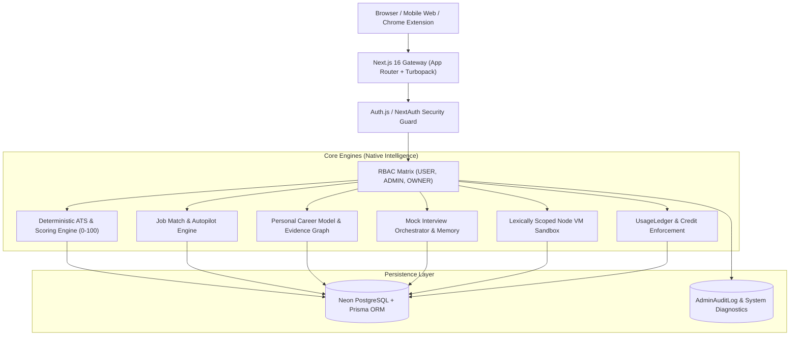

# ROLEVIA v2 — Master Technical Architecture Document

## 1. System Overview & Vision
ROLEVIA v2 ("BUILD BETTER. APPLY SMARTER. GET HIRED.") is a personal career intelligence workstation. It combines master profile identity, ATS resume analytics, job matching, mock interview simulations, adaptive roadmaps, coding arenas, and browser copilot workflows on top of a single database-backed career graph.

---

## 2. Technical Stack & Component Topology

---

## 3. Subsystem Architecture Specifications

### A. Authentication & Authorization Architecture
- **Authentication**: Auth.js session handling with credentials and Google OAuth.
- **RBAC Matrix**:
  - `USER`: Accesses personal dashboard, tools, and assigned credits.
  - `ADMIN`: Accesses `/admin` command center, monitors telemetry, reviews bugs/feedback.
  - `OWNER` (`chaitanyakumarsahu00@gmail.com`): Highest platform privileges, role assignment, and database-backed `OWNER_GRANT` PRO entitlement.
- **IDOR Protection**: Every database query joins authenticated user ID (`where: { id, userId }`).

### B. Personal Career Model & Evidence Graph
- Replaces disconnected profile fragments with a single unified `PersonalCareerModel`.
- Skills are classified into 4 verified confidence tiers:
  1. `VERIFIED`: Proven by passing platform assessments or solved coding tests.
  2. `STRONG`: Backed by parsed production projects and verified work history.
  3. `DECLARED`: Candidate self-reported competencies.
  4. `TARGET_GAP`: Identified market requirements missing from career evidence.

### C. Native Intelligence & Deterministic ATS Engine
- Operates offline-first without mandatory third-party AI APIs.
- 50+ deterministic checks scored across 4 core dimensions:
  1. Contact & Identity (20%)
  2. Document Structure & Standard Headings (35%)
  3. Skill Density & Semantic Overlap (25%)
  4. Action Verbs & Measurable Quantification (20%)
- Full ATS Simulator provides raw ASCII preview and parsing confidence checklists.

### D. Job Match & Application Autopilot
- Evaluates target job descriptions against verified candidate evidence.
- Autopilot ranking formula:
  $$\text{Autopilot Index} = \text{Job Match} \times \text{Resume Alignment} \times \text{Skill Readiness} \times \text{Interview Confidence}$$

### E. Mock Interview Lab & Weakness Memory
- Adaptive turn-by-turn question selection reacting to previous candidate answers.
- Fallback question engine (`InterviewQuestionEngine.ts`) maps keyword criteria when AI keys are absent.
- Tracks historical skill progression and feeds recurring weakness areas into the Roadmap and Practice modes.

### F. Coding Sandbox & Test Runner
- Sandboxed Node.js VM context isolated with lexical arrow function resolution.
- Compiles and runs test cases against submitted code with execution timeouts.

### G. Credit Management & Usage Ledger
- Real server-side enforcement via `UsageLedger` table.
- Plan limits: Free (5 starter credits), Launch ₹59 (50/mo), Career ₹99 (200/mo), Pro ₹149 (Unlimited / Owner Grant).

### H. Private Admin Control System
- Strict server-side route guard: Manual `/admin` access returns `403 Forbidden` for non-authorized users.
- Live telemetry: Database latency, Auth configuration, Audit logs, Feedback stream, and Bug triage.

### I. Browser Extension
- Manifest V3 architecture with strict field sanitization.
- Skips protected sensitive tags (SSN, credit cards, ethnicity, disability).
